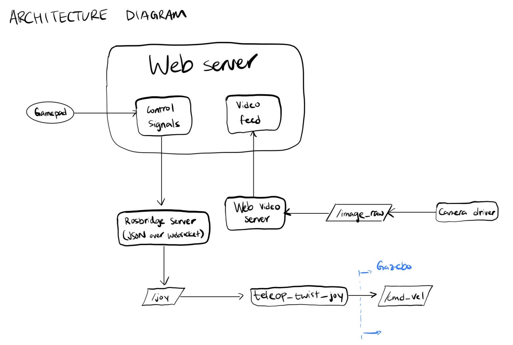

# ROS2 Differential Drive Robot Simulation

A simulated differential-drive robot in Gazebo, controlled remotely through a browser webpage and a gamepad, with live camera streaming and SLAM-based mapping. Built as a learning project to understand the ROS2 control stack, robot description (URDF/xacro), and the networking layer that connects a browser to a live robot session.

## Demo (redirect to Youtube)

* boots up Gazebo, web video server, rosbridge server, joystick node, and webpage in sequence.

## Components

- **Robot description**: a modular URDF built from xacro macros (chassis, wheels, caster, LiDAR, camera), with inertial properties computed per-link rather than guessed.
- **ros2_control architecture**: a `DiffDriveController` and `JointStateBroadcaster` running under `gazebo_ros2_control`, driven by a YAML-defined controller manager rather than hand-rolled motor code.
- **Sensor integration**: simulated LiDAR (`/scan`) and camera (`/camera/image`) plugins feeding into both SLAM and a live video stream.
- **SLAM**: `slam_toolbox` running in localization mode against the simulated LiDAR scan and odometry.
- **Networked teleoperation**: a physical gamepad running natively in ROS2 sending velocity commands on `/cmd_vel`, with the camera feed served separately via `web_video_server`.

## Architecture

**Simulation and control stack** — Gazebo hosts the robot model and the `ros2_control` stack (`diff_cont` + `joint_broad`), alongside the LiDAR and camera plugins. Sensor topics flow out to `slam_toolbox` (mapping), `twist_mux` (command arbitration), and RViz (visualization), all sharing a single TF tree from `map` down through `odom`, `base_link`, and the wheel/sensor frames.

**Teleoperation network path** — on a localhost machine:

**Gamepad → `teleop_twist_joy` → `/cmd_vel`.** The `joy` node reads raw gamepad input and `teleop_twist_joy` converts it into velocity commands. This runs natively in ROS2 on the same machine as Gazebo, so it needs no network bridge

## Stack

ROS2, Gazebo, ros2_control, slam_toolbox, rosbridge_server, web_video_server, xacro/URDF, RViz2

## Acknowledgment

Built while following Josh Newans's *Articulated Robotics* "Let's Build a Robot" series. Used as a structured way to learn the ROS2 ecosystem rather than as an original design. The architecture and launch sequence here reflect that series; my own work was implementing it, debugging the integration points, and understanding *why* each piece (controller manager, twist_mux priorities, the rosbridge/web_video_server split) exists.

## Known limitations

- The SLAM config (`mapper_params_online_async.yaml`) has a hardcoded map file path local to my machine — would need to be parameterized for anyone else to run this directly.
- Teleoperation is localhost-only; remote control was attempted but blocked by WSL networking (see above).
- This is simulation-only — no physical robot was built for this iteration.
